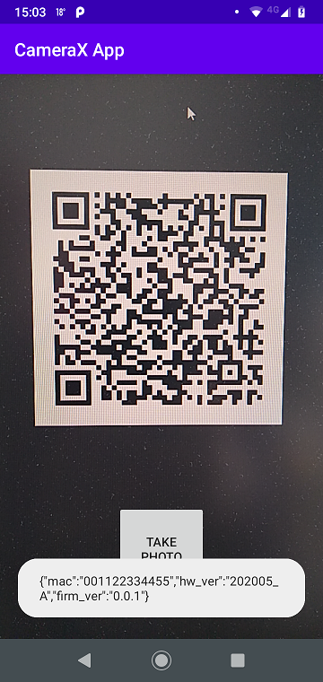

# QR Scanner with CameraX and ML-Kit barcode

Basic project using CameraX and ML-kit to decode bar and qr codes.

- Included CameraX dependencies
- Displayed a camera viewfinder (using Preview use case)
- Implemented photo capture, saving images to storage (using ImageCapture use case)
- Implemented analysis of frames from the camera in real time (using ImageAnalysis use case)
- Included ML kit barcode dependencies
- Implementing barcode decode in ImageAnalysis.Analyzer

## References

